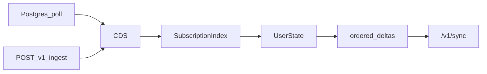

# SubState

**Status: early prototype.** A local sidecar that keeps an in-memory Current
Database State (CDS) from your Postgres (polled) and HTTP ingest, then syncs
equality-filtered subsets to clients over WebSocket.

It is not a database, not CDC, not Kafka, and not a hosted sync service.
Subscriptions evaluate the **CDS**, not Postgres.

## What it does today

- Bootstraps and polls Postgres-owned fields into an in-memory CDS
- Merges non-DB fields via `POST /v1/ingest` under a handwritten schema contract
- Clients subscribe over `ws://…/v1/sync` and receive snapshot + ordered deltas
- Field authority is enforced: only the owning source may update a field



## Run against your Postgres

This is the primary path. Point the sidecar at a database you control.

```bash
cp components/cli/.env.example .env
# Set DATABASE_URL to your local / Supabase / RDS Postgres
# Set SCHEMA_PATH=./schema.yaml
# Edit schema.yaml so postgres.table + fields match your columns

cargo run -p substate-cli -- serve
curl http://127.0.0.1:8080/health
```

| Env | Meaning |
| --- | --- |
| `DATABASE_URL` | **Required.** Any Postgres connection string |
| `SCHEMA_PATH` | **Required.** Path to handwritten sync schema YAML |
| `CDS_SCHEMA` | Postgres schema to introspect (default: `public`) |
| `CDS_POLL_MS` | Full-table poll interval in ms (default: `2000`) |
| `BIND_ADDR` | Listen address (default: `127.0.0.1:8080`) |

Every poll cycle **re-reads every mapped table** (`SELECT to_jsonb(t)`). Fine
for a small demo table; not appropriate for a large production table.

See [components/cli/.env.example](components/cli/.env.example) for the full list.

## Schema contract

The sync schema is the product contract. Clients subscribe and ingest by
**logical entity name**, never by physical table name.

[schema.yaml](schema.yaml) is a retargetable template (logical `driver` →
physical `Customers` is an illustration). The Compose demo uses
[deploy/compose/schema.yaml](deploy/compose/schema.yaml) (`drivers`).

```yaml
entities:
  driver:                          # client subscribe / ingest name
    identity:
      field: id
    sources:
      postgres:
        type: postgres
        table: Customers           # physical table in CDS_SCHEMA
      http:
        type: http
    fields:
      id:
        source: postgres
        mode: transactional
      name:
        source: postgres
        mode: transactional
      location:                    # only via POST /v1/ingest
        source: http
        mode: latest_value
        ordering: sequence
```

Rules:

- Identity field must appear under `fields`
- Each field’s `source` must be a key under `sources`
- A `postgres` source must name a `table`; that table must exist in
  `CDS_SCHEMA` and have a primary key, or the entity is skipped
- Only postgres-owned fields are loaded from the table; extra columns are ignored
- HTTP-owned fields exist only after ingest and are lost on process restart
- `flush_ms` is accepted in YAML but not implemented
- Automatic schema discovery is out of scope (see
  [Schema_Generation.md](Schema_Generation.md) for future direction)

## HTTP / WebSocket

Three surfaces. Bind to localhost for local work; `/v1/*` is **unauthenticated**.

### `GET /health`

```json
{ "status": "ok" }
```

### `POST /v1/ingest`

```json
{
  "source": "http",
  "entity_type": "driver",
  "id": "1",
  "fields": { "location": { "lat": 36.16, "lng": -86.78 } },
  "versions": { "location": 1 }
}
```

- `200` → `{ "accepted": true|false, "changed_fields": [...] }` (`accepted:
  false` when stale / no-op)
- `400` → unknown entity/source/field or authority violation
- `versions` are source-local; missing keys default to `stored+1`

### `GET /v1/sync` (WebSocket)

**Client → server**

| type | body |
| --- | --- |
| `subscribe` | `entity_type`, optional `where` (equality AND) |
| `resume` | `subscription`, `resume_after` |
| `unsubscribe` | `subscription` |
| `ack` | `subscription`, `seq` (advances resume watermark only; no backpressure) |

**Server → client:** `subscribed` → `snapshot`, then `delta` (`op`:
`add` / `update` / `remove`, per-subscription `seq`). Resume past retained
history → `reset` + snapshot. Bad JSON → `error`.

Example subscribe:

```json
{ "type": "subscribe", "entity_type": "driver", "where": { "status": "available" } }
```

## TypeScript client (optional)

Local package under [`clients/typescript`](clients/typescript) — build it
yourself; not assumed published.

```bash
cd clients/typescript && npm install && npm run build
```

API: `connect`, `subscribe`, `resume`, `unsubscribe`, `ack`, `ingest`.
End-to-end example against the Compose seed:
[scripts/smoke.mjs](scripts/smoke.mjs).

## Debug shell (optional)

Same boot as `serve`, then an interactive `cds>` REPL:

```bash
cargo run -p substate-cli -- shell
```

Useful commands: `tables`, `show`, `get`, `subscribe`, `state`, `unsub`.
Type `help` in the shell for the full list.

## Optional Compose demo

Self-contained toy stack if you do not want to point at a real database.
Seeds three `drivers` rows; `./scripts/smoke.sh` expects `driver` id `1`
(Alice).

```bash
docker compose up --build
curl http://127.0.0.1:8080/health
./scripts/smoke.sh   # Node 18+
```

To run the Compose image against **your** database instead, override
`DATABASE_URL` / mount your schema — see
[deploy/compose/README.md](deploy/compose/README.md).

## Known limits

| Today | Not yet |
| --- | --- |
| Postgres poll (full table) | CDC / WAL / logical replication |
| Handwritten `schema.yaml` | Schema discovery / generation |
| `postgres` + `http` ingest | Kafka, MySQL, Redis, GPS adapters |
| In-memory CDS, subscriptions, history | Persistence across restart |
| Equality `where` (AND) | Ranges, spatial/H3, OR, joins |
| Last 500 deltas per subscription; then reset | Durable / unlimited resume history |
| Ack does not pause delivery | Backpressure |
| Broadcast lag drops events | Guaranteed delivery under load |
| No auth on `/v1/*` | Authn/z, multi-tenant |
| Single process, HashMaps | Scale-out, partitioning |
| `flush_ms` in YAML unused | Latest-value coalescing |
| Freshness bound = `CDS_POLL_MS` | Sub-second DB change visibility |

HTTP-owned fields and resume history do not survive process restart. Postgres
fields are re-snapshotted on boot.

## Docs

- [SubState.md](SubState.md) — architecture / long-term vision
- [Schema_Generation.md](Schema_Generation.md) — future discovery & semantics
- [deploy/compose/README.md](deploy/compose/README.md) — optional demo overrides
- [clients/typescript/README.md](clients/typescript/README.md) — local TS client
